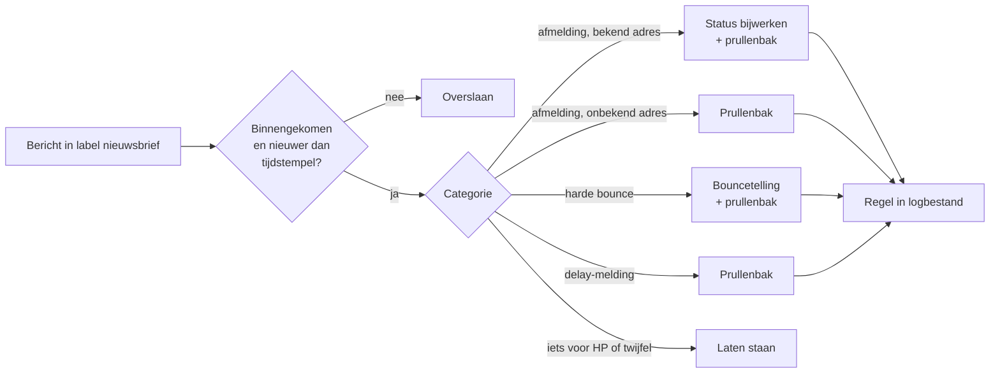

# Automatisch afhandelen van nieuwsbrief-replies - Plan

## Goal Capsule

- **Doel:** Het Gmail-label `nieuwsbrief` bevat alleen nog mail waar HP zelf iets mee
  moet. Alles wat routine is, is al afgehandeld voordat hij kijkt.
- **Productbeslisser:** HP.
- **Open blockers:** geen.

## Product Contract

### Summary

Een afhandelaar leest het label `nieuwsbrief`, laat elke inkomende reactie
classificeren en maakt drie categorieën zelf af: afmeldingen, delay-meldingen en harde
bounces. Wat een mens schreef blijft onaangeraakt staan. Elke afhandeling komt als regel
in een logbestand onder `data/`.

### Problem Frame

Het label bevat sinds oktober 2025 zeven threads en die zijn van drie verschillende
soorten. Er zitten echte lezersreacties in (een vraag over een kapotte URL, een verzoek
om een deelknop, een melding dat de nieuwsbrief niet meer aankomt), er zit machinale post
in (een Apple Mail one-click afmelding, een Gmail delay-melding, een harde bounce van
migadu) en er staan HP's eigen verzonden nieuwsbrieven en antwoorden tussen, omdat het
Gmail-filter hele threads labelt.

De machinale post kost aandacht die hij niet waard is. De delay-melding van Gmail
("Gmail will retry for 45 more hours") is geen storing en geen actie, alleen ruis.

Tegelijk is er een stil gat. `src/undelivered.py` telt bounces en zet abonnees op
`undeliverable`, maar `get_undelivered()` doet `mail.select('INBOX')` en het Gmail-filter
haalt deze mail juist uit INBOX. Op 26 september 2026 bevatte INBOX twee threads, geen
van beide nieuwsbrief-gerelateerd, terwijl de migadu-bounce uit oktober 2025 nog in het
label stond. De bouncetelling draait dus leeg en er wordt niemand meer op
`undeliverable` gezet.

### Key Decisions

- **Een LLM classificeert, geen trefwoordenlijst.**
  Trefwoorden missen "haal me van de lijst" en pakken juist "ik ontvang de nieuwsbrief
  niet meer" verkeerd op.
  (session-settled: user-directed, gekozen boven trefwoordherkenning)
  Governs R4, R5.
- **De afhandelaar wordt de enige verwerker van het label, inclusief de bounces.**
  De bestaande bounceafhandeling landt nergens meer; die functie verhuist mee in plaats
  van er een tweede ingang naast te zetten.
  (session-settled: user-directed, gekozen boven alleen afmelding en delay)
  Governs R1, R9.
- **Een afmelding van een onbekend adres verdwijnt zonder melding.**
  Er valt niets uit te schrijven en het gebeurt zelden genoeg om geen alarm waard te
  zijn.
  (session-settled: user-directed, gekozen boven laten liggen of `lg.error`)
  Governs R8.
- **Een tijdstempel in `data/` bepaalt wat al bekeken is.**
  Zonder dat zou dezelfde lezersvraag elke run opnieuw een gok krijgen, en één keer
  misgokken is genoeg.
  (session-settled: user-directed, gekozen boven een sublabel of een gelezen-markering)
  Governs R3.
- **Twee passes per run, voor en na verzending.**
  De migadu-bounce kwam 9 seconden na verzending binnen, de Gmail-delaymelding pas een
  dag later. Een pass vooraf zorgt bovendien dat wie zich gisteren afmeldde vandaag geen
  nieuwsbrief meer krijgt.
  (session-settled: user-approved, gekozen boven alleen na verzending)
  Governs R13, R14.
- **De afhandelaar mag de nieuwsbrief-run nooit afbreken.**
  `docs/architecture.md` noemt de stille abort met zoveel woorden als de oorzaak van het
  incident van 25 augustus 2026. Een pass vóór verzending maakt dat risico nieuw, want
  `undelivered.py` stapt nu bij een lege uitkomst en bij een IMAP-storing uit het proces.
  Governs R15.

### Actors

- A1. **Lezer** stuurt een antwoord op de nieuwsbrief, of drukt op de afmeldknop van zijn
  mailprogramma.
- A2. **Mailserver** (Gmail, migadu) stuurt delay-meldingen en bounces naar
  `nieuwsbrief@harmsen.nl`.
- A3. **Afhandelaar** leest het label, classificeert en voert uit.
- A4. **HP** behandelt wat overblijft.

### Requirements

**Bron en selectie**

- R1. De afhandelaar leest berichten met het Gmail-label `nieuwsbrief`. Dat label is zijn
  enige bron, ook voor bounces.
- R2. Hij verwerkt alleen binnengekomen berichten. Verzonden nieuwsbrieven en HP's eigen
  antwoorden slaat hij over.
- R3. Hij verwerkt alleen berichten die binnenkwamen na het tijdstempel van de vorige
  geslaagde pass. Dat tijdstempel staat in `data/` en schuift alleen op als de pass
  zonder fout is afgerond.

**Classificatie**

- R4. Elk bericht krijgt precies één categorie: afmelding, delay-melding, harde bounce,
  of iets voor HP.
- R5. Bij onvoldoende zekerheid kiest de afhandelaar "iets voor HP". Twijfel leidt nooit
  tot een uitschrijving of een verwijdering.

**Afhandeling per categorie**

- R6. Verwijderen gebeurt altijd per bericht, nooit per thread. De overige berichten in
  dezelfde thread blijven staan.
- R7. Afmelding van een bekend adres: het From-adres krijgt in `nieuwsbrief_subscriber`
  dezelfde status die de afmeldpagina op harmsen.nl zet, daarna gaat het bericht naar de
  prullenbak.
- R8. Afmelding van een adres dat niet in `nieuwsbrief_subscriber` staat: het bericht gaat
  naar de prullenbak, zonder melding en zonder databasewijziging.
- R9. Harde bounce: telt mee in de bestaande bouncetelling van `src/undelivered.py`, met
  de huidige drempels en het huidige onderscheid tussen 4xx en 5xx, daarna naar de
  prullenbak.
- R10. Delay-melding: naar de prullenbak, en telt niet mee in de bouncetelling. Een
  vertraging die uiteindelijk mislukt levert alsnog een harde bounce op en die telt wel.
- R11. Iets voor HP: het bericht blijft onaangeraakt in het label staan.

**Uitvoering en spoor**

- R12. Elke afhandeling schrijft één regel naar een logbestand in `data/`, met datum,
  afzender, categorie, uitgevoerde actie en het begin van de mailtekst. Genoeg om een
  misclassificatie te herkennen en met de hand terug te draaien.
- R13. De afhandelaar draait aan het begin van de nieuwsbrief-run, vóórdat de
  abonneelijst wordt opgehaald.
- R14. Hij draait opnieuw na verzending, op de plek waar `handle_undelivered()` nu staat.
- R15. Een fout in de afhandelaar breekt de nieuwsbrief-run nooit af. Hij logt volgens de
  regel in `docs/architecture.md`: `lg.warning` per mislukte poging, `lg.error` pas als de
  laatste poging faalt.
- R16. Bij `--dry-run` draait de afhandelaar niet. Geen uitschrijvingen, geen
  verwijderingen.

### Acceptance Examples

- AE1. **Covers R4, R7, R8, R12.** Een mail van `amy.klewis@hotmail.co.uk` met subject
  `unsubscribe` en body "Apple Mail sent this email to unsubscribe from the message". Het
  adres staat niet in `nieuwsbrief_subscriber`. Resultaat: bericht naar de prullenbak,
  geen databasewijziging, één regel in het logbestand.
- AE2. **Covers R5, R11.** Elise's mail "als ik me niet vergis ontvang ik de nieuwsbrief
  sinds 10 april niet meer". Resultaat: categorie "iets voor HP", bericht blijft staan,
  geen uitschrijving. Dit is een klacht over niet-bezorging, het tegenovergestelde van een
  afmelding.
- AE3. **Covers R6, R10.** De Gmail-melding "Delivery Status Notification (Delay)" over
  `hero@hetab.org`, die in dezelfde thread zit als de verzonden nieuwsbrief aan dat adres.
  Resultaat: alleen die ene mail naar de prullenbak, de verzonden nieuwsbrief blijft
  staan, de bouncetelling voor `hero@hetab.org` verandert niet.
- AE4. **Covers R9.** De migadu-mail "Undelivered Mail Returned to Sender" met een
  5xx-code. Resultaat: `permanent_count` gaat omhoog, bij het bereiken van de drempel
  wordt de abonnee op `undeliverable` gezet, mail naar de prullenbak.
- AE5. **Covers R15.** Het classificatiemodel is niet bereikbaar tijdens de pass vóór
  verzending. Resultaat: `lg.warning` per poging, `lg.error` na de laatste, het
  tijdstempel schuift niet op, en de nieuwsbrief gaat gewoon uit.
- AE6. **Covers R3.** Een lezersvraag die gisteren is binnengekomen en toen als "iets voor
  HP" is geclassificeerd. Resultaat: de run van vandaag kijkt er niet meer naar.

### Scope Boundaries

- Zelf antwoorden op lezersvragen. Die blijven staan en HP beantwoordt ze.
- De bouncedrempels en het resetgedrag. Die zijn in april 2026 al aangepast van twee naar
  vijf mislukkingen, met een reset zodra een volgende nieuwsbrief wel aankomt.
- Out-of-office-antwoorden als eigen categorie. Die vallen voorlopig onder "iets voor HP".
  Trigger om ze alsnog op te nemen: meer dan een handvol per maand in het logbestand.
- De afmeldpagina op harmsen.nl en het Django-project daarachter.
- Een bevestigingsmail naar wie zich afmeldt.

### Dependencies / Assumptions

- De afmeldpagina op harmsen.nl zet een bepaalde status in `nieuwsbrief_subscriber`.
  Welke waarde dat is moet bij het plannen worden opgezocht. De afhandelaar gebruikt
  precies dezelfde, zodat beide routes tot hetzelfde resultaat leiden.
- Het From-adres van een afmelding is het adres waarop de lezer geabonneerd is. Antwoordt
  iemand vanaf een tweede adres, dan valt dat onder R8 en verdwijnt de afmelding stil. Het
  logbestand is dan het enige spoor.
- Een classificatiefout richting "afmelding" is niet vanuit Gmail terug te draaien, want
  het bericht gaat naar de prullenbak en de status is al gewijzigd. Het logbestand uit R12
  is het vangnet.
- Het Gmail-filter blijft berichten met het label `nieuwsbrief` uit INBOX halen. Zodra de
  afhandelaar het label als bron gebruikt in plaats van INBOX, maakt dat niet meer uit.

### Outstanding Questions

**Resolve Before Planning**

Geen.

**Deferred to Planning**

- Welke statuswaarde de afmeldpagina in `nieuwsbrief_subscriber` zet.
- Welk model de classificatie doet en welke zekerheidsdrempel R5 hanteert.
- Hoe de bronquery van `src/undelivered.py` van INBOX naar het label gaat zonder de
  bestaande telling te veranderen, inclusief het weghalen van de `exit(0)` en `exit(1)`
  die R15 onmogelijk maken.
- Waar het tijdstempel uit R3 komt te staan, en of het één tijdstempel is voor beide
  passes.
- Of het logbestand uit R12 een eigen bestand wordt of aansluit bij `mailerlog.txt`.

### Sources / Research

- `src/undelivered.py`: bounceafhandeling, drempels, `handle_undelivered()`.
- `src/gmail.py:259` `get_undelivered()` selecteert INBOX; `src/gmail.py:76`
  `delete_email()` verplaatst per UID of Message-ID naar `[Gmail]/Trash`.
- `src/subscribers.py:64` `update_subscription()`; `src/subscribers.py:50`
  `get_subscriber_status()`.
- `src/mailer.py:60` zet de `List-Unsubscribe` header met
  `mailto:nieuwsbrief@harmsen.nl?subject=unsubscribe`. Dat is de bron van de machinale
  afmeldingen.
- `main.py:121` roept `handle_undelivered()` aan, 60 seconden na verzending.
- `docs/architecture.md`, sectie "Foutmelding en escalatie": elk pad dat de nieuwsbrief
  laat vervallen logt `lg.error`, transient faalgedrag logt `lg.warning` per poging.
- Gmail-label `nieuwsbrief` op 26 september 2026: 7 threads, 15 berichten, oktober 2025
  tot september 2026. Eén machinale afmelding, één Gmail delay-melding, één migadu
  bounce, vier lezersreacties, plus verzonden nieuwsbrieven en eigen antwoorden. INBOX
  bevatte op dat moment 2 threads, geen van beide nieuwsbrief-gerelateerd.
- Thread "Re: HP's AI daily - 6 april" (19 april 2026): bevestigt dat de drempelwijziging
  van twee naar vijf en de reset bij geslaagde bezorging al zijn doorgevoerd.
