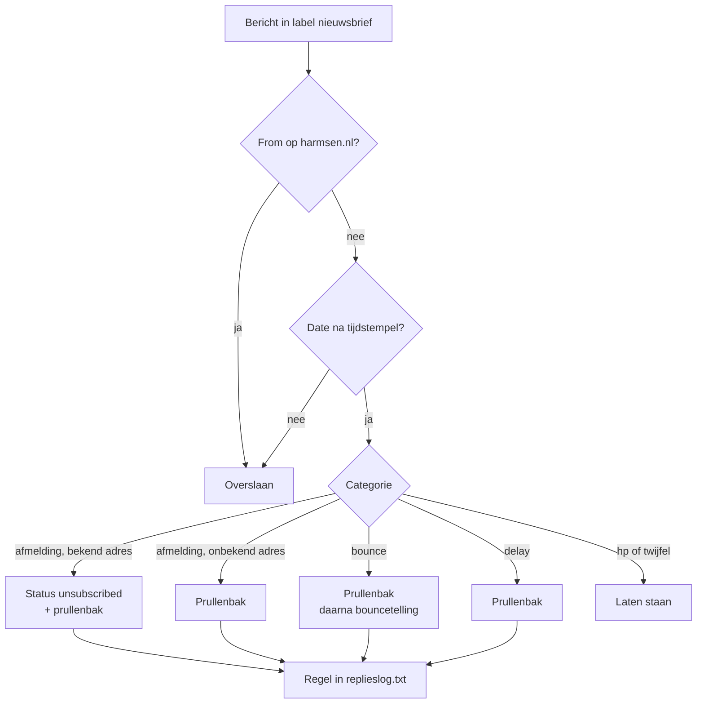
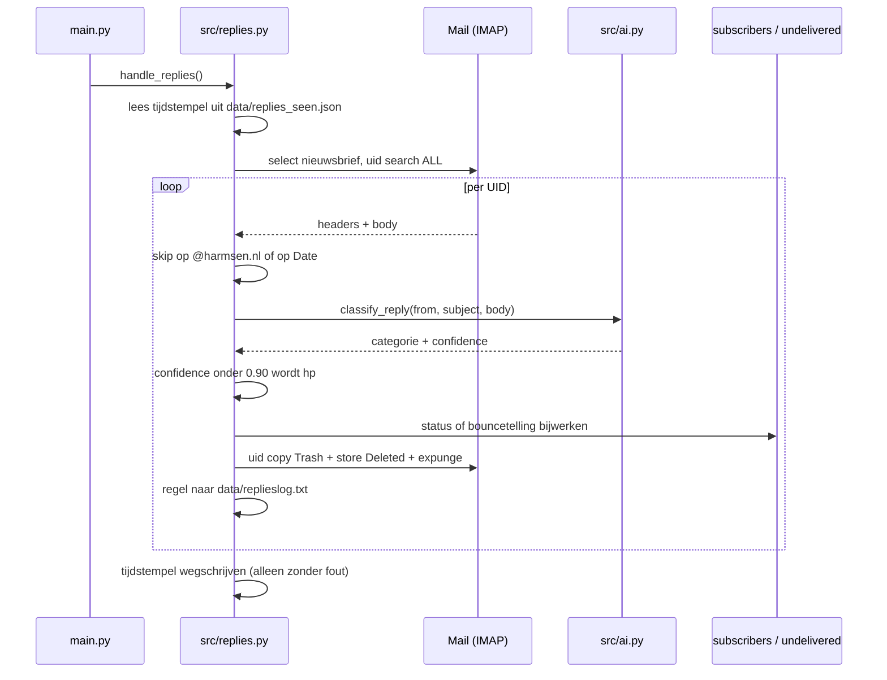

# Automatisch afhandelen van nieuwsbrief-replies - Plan

## Goal Capsule

- **Objective:** Wie zich afmeldt op de nieuwsbrief is daarna ook echt afgemeld, bouncende adressen worden weer geteld, en in het Gmail-label `nieuwsbrief` staat alleen nog post waar HP zelf iets mee moet.
- **Means:** Een afhandelaar leest het label, laat elk binnengekomen bericht door een System One classifier in vier categorieën indelen en maakt afmeldingen, delay-meldingen en harde bounces zelf af (KTD1).
- **Authority:** Het requirementsdocument in `origin:` bepaalt het gedrag. Waar dit plan een aanname daaruit corrigeert, staat dat als feit bij de betrokken R.
- **Stop conditions:** De afhandelaar breekt de nieuwsbrief-run nooit af (R15). Twijfel over een categorie leidt nooit tot een uitschrijving of een verwijdering (R5).
- **Execution profile:** Test-first op de classificatie- en actielogica; de IMAP- en modelkoppeling wordt met mocks bewezen, zoals de bestaande tests in `tests/main.py` dat doen.

---

## Product Contract

### Summary

Een nieuw module `src/replies.py` wordt de enige verwerker van het Gmail-label `nieuwsbrief`. Hij classificeert elk binnengekomen bericht met een System One model, voert per categorie de afhandeling uit, schrijft één logregel per behandeld bericht en draait twee keer per nieuwsbrief-run. De bestaande bounceafhandeling verhuist van INBOX naar het label; de oude INBOX-ingang verdwijnt in plaats van ernaast te blijven staan.

### Problem Frame

Het label `nieuwsbrief` bevat op 26 september 2026 vijftien berichten uit vier kwartalen, en die zijn van drie soorten. Er zitten echte lezersreacties in, er zit machinale post in (een Apple Mail one-click afmelding, een Gmail delay-melding, een harde bounce van migadu) en er staan HP's eigen verzonden nieuwsbrieven en antwoorden tussen, omdat het Gmail-filter hele threads labelt. De machinale post kost aandacht die hij niet waard is.

Tegelijk is er een stil gat. `src/undelivered.py` telt bounces en zet abonnees op `undeliverable`, maar `Mail.get_undelivered()` selecteert `INBOX` terwijl het Gmail-filter deze mail juist uit INBOX haalt. De bouncetelling draait dus leeg. De migadu-bounce van 3 oktober 2025 staat nog ongeteld in het label.

De afmelding heeft hetzelfde gat. De Apple Mail one-click afmelding van 23 september 2026 is nooit verwerkt, en die afzender staat nog steeds op status `daily`.

### Key Decisions

- Een model classificeert, geen trefwoordenlijst. Trefwoorden missen "haal me van de lijst" en pakken juist "ik ontvang de nieuwsbrief niet meer" verkeerd op. Het model is een System One classifier, die geen tekst genereert maar per categorie een gekalibreerde kans teruggeeft. Governs R4, R5.
- De afhandelaar wordt de enige verwerker van het label, inclusief de bounces. De bestaande bounceafhandeling landt nergens meer; die verhuist mee in plaats van er een tweede ingang naast te zetten. Governs R1, R9.
- Een afmelding van een onbekend adres verdwijnt zonder melding. Er valt niets uit te schrijven en het gebeurt zelden genoeg om geen alarm waard te zijn. Governs R8.
- Een tijdstempel in `data/` bepaalt wat al bekeken is. Zonder dat zou dezelfde lezersvraag elke run opnieuw een gok krijgen, en één keer misgokken is genoeg. Governs R3.
- Twee passes per run, voor en na verzending. De migadu-bounce kwam 9 seconden na verzending binnen, de Gmail-delaymelding pas een dag later. Een pass vooraf zorgt bovendien dat wie zich gisteren afmeldde vandaag geen nieuwsbrief meer krijgt. Governs R13, R14.
- De afhandelaar mag de nieuwsbrief-run nooit afbreken. `docs/architecture.md` noemt de stille abort met zoveel woorden als de oorzaak van het incident van 25 augustus 2026. Governs R15.

### Actors

- A1. Lezer stuurt een antwoord op de nieuwsbrief, of drukt op de afmeldknop van zijn mailprogramma.
- A2. Mailserver (Gmail, migadu) stuurt delay-meldingen en bounces naar `nieuwsbrief@harmsen.nl`.
- A3. Afhandelaar leest het label, classificeert en voert uit.
- A4. HP behandelt wat overblijft.

### Requirements

**Bron en selectie**

- R1. De afhandelaar leest berichten met het Gmail-label `nieuwsbrief`. Dat label is zijn enige bron, ook voor bounces. Het label is als IMAP-folder `nieuwsbrief` selecteerbaar.
- R2. Hij verwerkt alleen binnengekomen berichten. Een bericht waarvan het From-adres op `@harmsen.nl` eindigt slaat hij over; dat dekt zowel de verzonden nieuwsbrieven als HP's eigen antwoorden.
- R3. Hij verwerkt alleen berichten met een `Date` na het tijdstempel van de vorige geslaagde pass. Dat tijdstempel staat in `data/replies_seen.json` en schuift alleen op als de pass zonder fout is afgerond. Ontbreekt het bestand, dan verwerkt hij alles wat in het label staat.

**Classificatie**

- R4. Elk bericht krijgt precies één categorie: `afmelding`, `delay`, `bounce`, of `hp`.
- R5. Bij een confidence onder `MIN_CONFIDENCE` (0.90) wordt de categorie `hp`, wat het model ook koos. Twijfel leidt nooit tot een uitschrijving of een verwijdering.

**Afhandeling per categorie**

- R6. Verwijderen gebeurt altijd per bericht via het UID in de labelfolder, nooit per thread. De overige berichten in dezelfde thread blijven staan.
- R7. Afmelding van een adres dat in `nieuwsbrief_subscriber` staat: het From-adres krijgt status `unsubscribed`, dezelfde waarde die de afmeldpagina op harmsen.nl zet, daarna gaat het bericht naar de prullenbak.
- R8. Afmelding van een adres dat niet in `nieuwsbrief_subscriber` staat: het bericht gaat naar de prullenbak, zonder databasewijziging en zonder enige log op niveau ERROR of hoger.
- R9. Harde bounce: telt mee in de bouncetelling van `src/undelivered.py`, met de huidige drempels en het huidige onderscheid tussen 4xx en 5xx, daarna naar de prullenbak. Tellen gebeurt pas nadat het verwijderen geslaagd is, zodat een mislukte verwijdering niet tot dubbeltellen leidt bij de volgende pass.
- R10. Delay-melding: naar de prullenbak, en telt niet mee in de bouncetelling. Een vertraging die uiteindelijk mislukt levert alsnog een harde bounce op en die telt wel.
- R11. Iets voor HP: het bericht blijft onaangeraakt in het label staan.

**Uitvoering en spoor**

- R12. Elke afhandeling schrijft één tab-gescheiden regel naar `data/replieslog.txt`, met tijdstempel, afzender, categorie, uitgevoerde actie en de eerste 200 tekens van de mailtekst op één regel. Genoeg om een misclassificatie te herkennen en met de hand terug te draaien.
- R13. De afhandelaar draait aan het begin van de nieuwsbrief-run, vóórdat de abonneelijst wordt opgehaald.
- R14. Hij draait opnieuw na verzending, op de plek waar `handle_undelivered()` nu staat.
- R15. Een fout in de afhandelaar breekt de nieuwsbrief-run nooit af. Hij logt volgens de regel in `docs/architecture.md`: `lg.warning` per mislukte poging, `lg.error` pas als de laatste poging faalt. Geen enkel pad in de afhandelaar roept `exit()` aan.
- R16. Bij `--dry-run` draait de afhandelaar niet. Geen uitschrijvingen, geen verwijderingen.

### Acceptance Examples

- AE1. **Covers R4, R7, R12.** Een mail van `amy.klewis@hotmail.co.uk` met subject `unsubscribe` en body "Apple Mail sent this email to unsubscribe from the message". Het adres staat in `nieuwsbrief_subscriber` met status `daily`. Resultaat: status wordt `unsubscribed`, bericht naar de prullenbak, één regel in `data/replieslog.txt`.
- AE2. **Covers R5, R11.** Elise's mail "als ik me niet vergis ontvang ik de nieuwsbrief sinds 10 april niet meer". Resultaat: categorie `hp`, bericht blijft staan, geen uitschrijving. Dit is een klacht over niet-bezorging, het tegenovergestelde van een afmelding.
- AE3. **Covers R6, R10.** De Gmail-melding "Delivery Status Notification (Delay)" over `hero@hetab.org`, die in dezelfde thread zit als de verzonden nieuwsbrief aan dat adres. Resultaat: alleen die ene mail naar de prullenbak, de verzonden nieuwsbrief blijft staan, de bouncetelling voor `hero@hetab.org` verandert niet.
- AE4. **Covers R9.** De migadu-mail "Undelivered Mail Returned to Sender" met een 5xx-code. Resultaat: `permanent_count` gaat omhoog, bij het bereiken van de drempel wordt de abonnee op `undeliverable` gezet, mail naar de prullenbak.
- AE5. **Covers R15.** Het classificatiemodel is niet bereikbaar tijdens de pass vóór verzending. Resultaat: `lg.warning` per poging, `lg.error` na de laatste, het tijdstempel schuift niet op, en de nieuwsbrief gaat gewoon uit.
- AE6. **Covers R3.** Een lezersvraag die gisteren is binnengekomen en toen als `hp` is geclassificeerd. Resultaat: de run van vandaag kijkt er niet meer naar.
- AE7. **Covers R8.** Een afmelding van een adres dat niet in `nieuwsbrief_subscriber` staat. Resultaat: prullenbak, geen databaseschrijfactie, en geen `lg.error` — dus geen Janitor-issue.

### Scope Boundaries

- Zelf antwoorden op lezersvragen. Die blijven staan en HP beantwoordt ze.
- De bouncedrempels en het resetgedrag blijven zoals ze zijn: `PERMANENT_BOUNCE_THRESHOLD = 2` voor 5xx, `TEMPORARY_BOUNCE_THRESHOLD = 5` voor 4xx, reset na 30 dagen zonder bounce of zodra iemand zich opnieuw aanmeldt.
- Out-of-office-antwoorden als eigen categorie. Die vallen voorlopig onder `hp`. Trigger om ze alsnog op te nemen: meer dan een handvol per maand in `data/replieslog.txt`.
- De afmeldpagina op harmsen.nl en het Django-project daarachter.
- Een bevestigingsmail naar wie zich afmeldt.

#### Deferred to Follow-Up Work

- `src/log.py` is een ongebruikte kopie van justlog die niemand importeert. Opruimen hoort niet bij deze wijziging.
- `src/mailer.delete_email()` opent per aanroep een nieuwe IMAP-verbinding en sluit die nooit. De afhandelaar omzeilt dat door zijn eigen `Mail` te hergebruiken; de bestaande lek in de verzendroute blijft staan.

### Outstanding Questions

Geen. De vijf vragen die het requirementsdocument naar het plannen doorschoof zijn beantwoord in R3, R7, R12 en KTD1 tot en met KTD4.

---

## Planning Contract

### Key Technical Decisions

- KTD1. **Classificatie met `Model.classify()` op `openrouter/typesafe/jev-1.13`, een System One model.** Instantieert de Key Decision die R4 en R5 bestuurt. Zo'n model genereert geen tekst: het leest een toestand, kiest uit een dict van categorieën en geeft per categorie een gekalibreerde kans plus een confidence terug. Dat maakt de zekerheidsdrempel uit R5 een getal in plaats van een promptregel, want deze kansen zijn wél gekalibreerd. Antwoordtijd is 260 tot 660 ms tegen 403 in- en 49 uit-tokens, dus een pass over het hele label kost minder dan één artikel eindredactie.
- KTD2. **Geen prompt-bestand en geen wijziging aan `retry_prompt()`.** De vier categorieën met hun omschrijving zijn de `options`-dict, en de twijfelregel staat in `instructions`; er valt niets te templaten met `load_prompt()`. `classify()` is geen `prompt()`-aanroep, dus de helper waar de hele nieuwsbriefpijplijn op leunt blijft onaangeraakt. `classify()` retryt zelf tweemaal op 429 en 529 en vertaalt HTTP-fouten naar dezelfde justai-excepties; de buitenste `try`/`except` van de afhandelaar dekt R15.
- KTD3. **Eigen logbestand `data/replieslog.txt`, tab-gescheiden.** `mailerlog.txt` heeft een vast drieveldenformaat dat `already_sent_today()` en `get_mailerlog()` met `split()` uit elkaar trekken; er mailtekst bij schuiven maakt die parsers stil onbetrouwbaar. Tabs omdat het laatste veld vrije tekst met spaties is.
- KTD4. **Eén tijdstempel voor beide passes, in `data/replies_seen.json`.** De passes doen hetzelfde werk op dezelfde bron; twee tijdstempels zouden alleen maar uit elkaar kunnen lopen. Het tijdstempel is het moment waarop de pass begon, niet het moment waarop hij klaar was, zodat post die tijdens de pass binnenkomt de volgende keer alsnog wordt gezien.
- KTD5. **`get_subscriber_status()` gooit databasefouten door in plaats van ze te slikken.** Nu logt de functie `lg.error` en geeft `None` terug, precies hetzelfde antwoord als voor een adres dat niet bestaat. Onder R7 en R8 zou een databasestoring dan elke afmelding stil in de prullenbak gooien zonder uit te schrijven. Met doorgooien wordt het een mislukte pass: het tijdstempel schuift niet op en de volgende run doet het werk over.
- KTD6. **Uitschrijven alleen na een geslaagde lookup, nooit blind.** `update_subscription()` logt `lg.error` als er geen rij wordt geraakt. Blind aanroepen bij een onbekend adres zou dus een Janitor-issue opleveren bij precies het geval dat volgens R8 stil moet verlopen.
- KTD7. **De bounce-ingang op INBOX verdwijnt.** `Mail.get_undelivered()` en de functies `get_mail()`, `get_undelivered_emails()`, `delete_emails()` en `handle_undelivered()` in `src/undelivered.py` worden verwijderd. Ze bevatten de `exit(0)` en `exit(1)` die R15 onmogelijk maken, en ze zoeken op een plek waar de post niet meer komt. De telfuncties `parse_undelivered_emails()` en `mark_undeliverable()` blijven ongewijzigd, zodat R9 letterlijk waar blijft.
- KTD8. **`justai` gaat van `>=5.5.0` naar `>=5.7.1`.** `Model.classify()` bestaat pas in 5.7.1. De rest van de API is onveranderd: `prompt()`, `chat()` en `generate_image()` houden hun signature en de excepties die `src/ai.py` importeert bestaan nog. `OPENROUTER_API_KEY` staat al in `.env` en in productie; een `TYPESAFE_API_KEY` is niet nodig omdat de route via OpenRouter loopt.

### High-Level Technical Design

De afhandelaar is één pass over één IMAP-folder. De volgorde binnen die pass is wat de garanties draagt: filteren is goedkoop en gebeurt vóór het model, en het verwijderen gaat vooraf aan het tellen zodat een mislukte verwijdering niet tot dubbeltellen leidt.

Het oude en het nieuwe bouncepad naast elkaar:

| | Nu | Na deze wijziging |
|---|---|---|
| Bron | `INBOX`, filter op afzender Mail Delivery Subsystem | label `nieuwsbrief`, categorie uit de classificatie |
| Delay-melding | telt mee als bounce | apart, telt niet mee (R10) |
| Bij nul resultaten | `exit(0)`, hele proces stopt | pass klaar, run gaat door (R15) |
| Bij IMAP-fout | `exit(1)`, hele proces stopt | `lg.error`, tijdstempel blijft staan (R15) |
| Verwijderen | nieuwe IMAP-verbinding per mail, uit `INBOX` | hergebruikte verbinding, uit het label (R6) |

### Assumptions

- Het From-adres van een afmelding is het adres waarop de lezer geabonneerd is. Antwoordt iemand vanaf een tweede adres, dan valt dat onder R8 en verdwijnt de afmelding stil. `data/replieslog.txt` is dan het enige spoor.
- Een classificatiefout richting `afmelding` is niet vanuit Gmail terug te draaien: het bericht staat in de prullenbak en de status is al gewijzigd. Het logbestand uit R12 is het vangnet.
- Het Gmail-filter blijft berichten met het label `nieuwsbrief` uit INBOX halen. Zodra de afhandelaar het label als bron gebruikt, maakt dat niet meer uit.
- De eerste run heeft geen tijdstempel en verwerkt daarom de hele achterstand in het label. Concreet: de migadu-bounce van oktober 2025 wordt alsnog geteld met de datum van vandaag, de Gmail-delaymelding verdwijnt, en `amy.klewis@hotmail.co.uk` wordt echt uitgeschreven. De lezersreacties van Elise en Thomas blijven staan.
- Die migadu-bounce zet meteen een abonnee op `undeliverable`. Hij gaat over `jeroen@nas.nl`, die status `daily` heeft en in `data/undelivered.json` al op `count: 16, permanent_count: 0` staat. Het is een 5xx, dus na tellen wordt het `count: 17, permanent_count: 1` en zakt de drempel naar `PERMANENT_BOUNCE_THRESHOLD` (2). Dat is precies wat R9 vraagt, maar het is wel een statuswijziging en niet alleen een tellertje. Alle dertig entries in dat bestand staan op `permanent_count: 0` met `count >= 1`, dus bij hun volgende 5xx geldt hetzelfde.
- De 550 in die bounce is `Sender's policy prohibits this message: Reject` van de ontvangende server, geen niet-bestaand postvak. De spam-detectie in `_extract_original_recipient()` zoekt op woorden als spam en blacklist en pikt deze formulering niet op, dus hij telt als harde bounce. Dat gedrag blijft zoals het is, want R9 houdt de telfuncties ongewijzigd.

### Sequencing

Dit is één lineaire draad. Vier van de vijf units schrijven tests in `tests/main.py`, en dat bestand heeft maar één schrijver tegelijk.

| # | Taak | Touches | Depends on |
|---|---|---|---|
| U1 | Classificatie met een System One model | `pyproject.toml`, `uv.lock`, `src/ai.py`, `tests/main.py` | - |
| U2 | Abonnee-lookup faalt hard bij databasefouten | `src/subscribers.py`, `tests/main.py` | U1 |
| U3 | Afhandelaar met tijdstempel, logboek en acties | `src/replies.py`, `tests/main.py` | U1, U2 |
| U4 | Oude INBOX-bounceroute opruimen | `src/undelivered.py`, `src/gmail.py`, `tests/main.py` | U3 |
| U5 | Twee passes in de nieuwsbrief-run | `main.py`, `docs/architecture.md` | U3, U4 |

U2 hangt inhoudelijk niet van U1 af; de afhankelijkheid bestaat alleen omdat beide in `tests/main.py` schrijven. Wie ze toch parallel wil draaien, moet de testtoevoegingen achteraf met de hand samenvoegen.

---

## Implementation Units

### U1. Classificatie met een System One model

- **Goal:** Een functie die uit afzender, onderwerp en mailtekst precies één van vier categorieën teruggeeft, met de twijfel-naar-`hp` regel als drempel op de confidence.
- **Requirements:** R4, R5. Instantieert KTD1, KTD2 en KTD8.
- **Dependencies:** geen.
- **Files:** `pyproject.toml`, `uv.lock`, `src/ai.py`, `tests/main.py`
- **Approach:**
  1. `justai` in `pyproject.toml` naar `>=5.7.1`, daarna `uv lock`.
  2. In `src/ai.py` naast de bestaande modelconstanten een `CLASSIFY_MODEL = 'openrouter/typesafe/jev-1.13'` en een `MIN_CONFIDENCE = 0.90`. De vier categorieën staan als module-dict `REPLY_CATEGORIES`, met per categorie de omschrijving die het model te zien krijgt; de twijfelregel staat in een `CLASSIFY_INSTRUCTIONS`-constante, met de "ik ontvang de nieuwsbrief niet meer"-klacht als uitgewerkt tegenvoorbeeld van een afmelding.
  3. `classify_reply(sender, subject, body)` bouwt de toestand als één tekst, kapt de mailtekst af op een vaste lengte, en roept `model.classify(state, REPLY_CATEGORIES, instructions=CLASSIFY_INSTRUCTIONS, cached=False)` aan. Uit het antwoord komen `choice` en `confidence`; onder `MIN_CONFIDENCE` wordt de uitkomst `hp`.
  4. Geen eigen retry-lus. `classify()` retryt zelf op 429 en 529, en wat daarna nog faalt hoort volgens R15 bij de afhandelaar thuis.
- **Patterns to follow:** `extract_relevant_source_text()` voor de vorm van een kleine, losse modelaanroep met een eigen modelconstante. `cached=False` zoals elke andere modelaanroep in `src/ai.py`.
- **Execution note:** De testsuite moet vóór de versiebump al draaien en na de bump nog steeds 23/23 slagen; dat is het bewijs dat 5.7.1 de bestaande pijplijn niet raakt.
- **Test scenarios:**
  - Covers AE2. Een gemockt model dat `hp` met hoge confidence teruggeeft op Elise's tekst levert categorie `hp`.
  - Covers R5. Een gemockt model dat `afmelding` met confidence 0.80 teruggeeft levert categorie `hp`, niet `afmelding`.
  - Een confidence precies op `MIN_CONFIDENCE` levert de gekozen categorie, niet `hp`.
  - `classify()` krijgt alle vier de categorieën als opties mee, zodat het model nooit uit minder kan kiezen dan R4 voorschrijft.
  - Een mailtekst langer dan de afkaplengte wordt afgekapt voordat hij naar het model gaat.
  - Een leeg of ontbrekend body-veld levert geen exception maar een normale classificatie-aanroep.
  - Een exception uit `classify()` komt ongewijzigd naar buiten, zodat de afhandelaar hem onder R15 kan opvangen.
- **Verification:** `uv run python tests/main.py` slaagt volledig, inclusief de vier bestaande `retry_prompt`-tests die deze unit niet aanraakt.

### U2. Abonnee-lookup faalt hard bij databasefouten

- **Goal:** Een databasestoring is niet langer te verwarren met "adres bestaat niet".
- **Requirements:** R7, R8. Instantieert KTD5.
- **Dependencies:** U1, alleen omdat beide in `tests/main.py` schrijven.
- **Files:** `src/subscribers.py`, `tests/main.py`
- **Approach:** `get_subscriber_status()` vangt de exception niet meer af; de `lg.error` daar verdwijnt en de fout gaat naar de aanroeper. `None` betekent voortaan uitsluitend "geen rij gevonden". De enige bestaande aanroeper is `mark_undeliverable()` in `src/undelivered.py`, en die draait na U3 binnen de try/except van de afhandelaar, dus een storing wordt daar een mislukte pass in plaats van een stille misrekening.
- **Patterns to follow:** `get_subscribers()` in hetzelfde bestand gooit al door in plaats van te slikken.
- **Test scenarios:**
  - Een databasefout tijdens `get_subscriber_status()` komt als exception naar buiten in plaats van als `None`.
  - Een adres dat niet in de tabel staat levert nog steeds `None`, zonder exception en zonder `lg.error`.
  - Een bestaand adres levert onveranderd een dict met `status` en `updated_at`.
- **Verification:** De bestaande testsuite slaagt en de drie nieuwe scenario's zijn gedekt.

### U3. Afhandelaar met tijdstempel, logboek en acties

- **Goal:** De afhandelaar draait één pass over het label en voert per categorie de juiste actie uit, zonder ooit te kunnen crashen in de aanroeper.
- **Requirements:** R1, R2, R3, R6, R7, R8, R9, R10, R11, R12, R15. Instantieert KTD3, KTD4, KTD6.
- **Dependencies:** U1, U2.
- **Files:** `src/replies.py` (nieuw), `tests/main.py`
- **Approach:**
  1. `handle_replies()` is de enige publieke ingang. Hij leest het tijdstempel, opent één `Mail`, selecteert de labelfolder niet-readonly, en doorloopt de UID's.
  2. Filteren vóór het model: een bericht waarvan het From-adres op `@harmsen.nl` eindigt wordt overgeslagen (R2), net als een bericht met een `Date` op of vóór het tijdstempel (R3). `get_email_details()` levert beide velden al.
  3. Per categorie één actie. Bij `afmelding` eerst `get_subscriber_status()`; alleen bij een gevonden rij volgt `update_subscription(adres, 'unsubscribed')` (R7, KTD6), daarna verwijderen. Bij `bounce` eerst verwijderen en pas bij succes tellen (R9); de recipient en het 4xx/5xx-onderscheid komen uit het bestaande `Mail._extract_original_recipient()`, dat een geparst mailobject verwacht, dus de bounce-tak heeft de volledige mail nodig en niet alleen de tekst die de classificatie kreeg. Levert die extractie geen adres op, dan blijft het bericht staan en wordt er niet geteld. Bij `delay` alleen verwijderen (R10). Bij `hp` gebeurt niets (R11).
  4. Verwijderen gaat via `Mail.delete_email(uid, folder='nieuwsbrief')`, dus per bericht en op de hergebruikte verbinding (R6). Die functie doet `identifier.isdigit()`, dus de UID gaat er als `str` in en niet als de bytes die `uid('search')` teruggeeft.
  5. Elke uitgevoerde actie schrijft één tab-gescheiden regel; regelafbrekingen in het tekstfragment worden vervangen door spaties zodat de regel één regel blijft (R12).
  6. De hele body staat in een `try`/`except Exception` die `lg.error` logt en terugkeert; het tijdstempel wordt alleen weggeschreven als de pass die except niet raakte (R15). Geen `exit()` op welk pad dan ook.
  7. Een `if __name__ == '__main__'` met `load_dotenv()` maakt een handmatige pass mogelijk, zoals `src/undelivered.py` dat nu heeft.
- **Patterns to follow:** `src/undelivered.py` voor de vorm van een module met losse, testbare functies en een `__main__`-ingang. `src/gmail.py` `fetch_window_start()` voor het lezen van een tijdstempel uit een JSON-bestand in `data/` met een nette terugval bij een ontbrekend of kapot bestand. `src/mailer.py` `mailerlog()` voor het appenden van een regel.
- **Execution note:** Bouw dit test-first met een gemockte `Mail` en een gemockte classificatie. Het echte label is geen testomgeving: een fout hier gooit post weg en schrijft abonnees uit.
- **Test scenarios:**
  - Covers AE1. Afmelding van een adres met status `daily` levert `update_subscription(adres, 'unsubscribed')`, één verwijdering en één logregel.
  - Covers AE7. Afmelding van een adres dat niet in de tabel staat levert géén `update_subscription`, wel een verwijdering en een logregel, en geen enkele `lg.error`.
  - Covers AE3. Categorie `delay` verwijdert alleen het bericht zelf en raakt `data/undelivered.json` niet aan.
  - Covers AE4. Categorie `bounce` met een 5xx-code verhoogt `permanent_count` voor het geëxtraheerde adres en verwijdert het bericht.
  - Bij `bounce` waarvan de verwijdering mislukt wordt niet geteld en blijft het bericht staan.
  - Bij `bounce` waaruit geen ontvangeradres te halen is wordt niet geteld en blijft het bericht staan.
  - Covers AE6. Een bericht met een `Date` vóór het tijdstempel wordt overgeslagen zonder modelaanroep.
  - Covers R2. Een bericht van `nieuwsbrief@harmsen.nl` en een van `hp@harmsen.nl` worden overgeslagen zonder modelaanroep.
  - Covers AE5. Een exception uit de classificatie levert één `lg.error`, laat het tijdstempel ongewijzigd, en `handle_replies()` gooit niets door.
  - Een mislukte IMAP-verbinding levert `lg.error` en een terugkeer, geen exception en geen `exit()`.
  - Een leeg label levert geen fout en schuift het tijdstempel wél op.
  - Een ontbrekend `data/replies_seen.json` laat alle berichten in het label door het filter.
  - Categorie `hp` raakt het bericht niet aan en schrijft geen logregel.
  - Een logregel met een mailtekst die regelafbrekingen bevat blijft één regel in het bestand.
  - Het tijdstempel dat wordt weggeschreven is het begin van de pass, niet het einde.
- **Verification:** Alle scenario's slagen met gemockte IMAP en gemockt model. `data/undelivered.json` en de database worden in geen enkele test echt aangeraakt.

### U4. Oude INBOX-bounceroute opruimen

- **Goal:** Er is nog maar één ingang voor bounces, en geen enkel pad kan het proces meer afbreken met `exit()`.
- **Requirements:** R1, R15. Instantieert KTD7.
- **Dependencies:** U3.
- **Files:** `src/undelivered.py`, `src/gmail.py`
- **Approach:**
  1. Uit `src/undelivered.py` verdwijnen `get_mail()`, `get_undelivered_emails()`, `delete_emails()` en `handle_undelivered()`, met de imports die daarmee overbodig worden.
  2. `parse_undelivered_emails()`, `mark_undeliverable()`, `load_undelivered_data()`, `save_undelivered_data()`, `reset_undelivered()` en `cleanup_stale_entries()` blijven ongewijzigd; R9 leunt erop.
  3. Uit `src/gmail.py` verdwijnt `Mail.get_undelivered()`. `Mail._extract_original_recipient()` blijft, want de afhandelaar gebruikt die.
  4. De `__main__`-ingang van `src/undelivered.py` verdwijnt mee; de handmatige ingang is voortaan die van `src/replies.py`.
- **Patterns to follow:** geen; dit is verwijderwerk.
- **Test scenarios:**
  - Geen enkel bestand importeert nog `handle_undelivered` of `get_undelivered`.
  - `parse_undelivered_emails()` en `mark_undeliverable()` gedragen zich onveranderd op een vaste set bounce-dicts, inclusief het onderscheid tussen `permanent_count` en `count` en de spam-rejection die niet meetelt.
  - Geen enkel `exit()` meer in `src/undelivered.py`.
- **Verification:** De volledige testsuite slaagt en `main.py` importeert niets dat niet meer bestaat.

### U5. Twee passes in de nieuwsbrief-run

- **Goal:** De afhandelaar draait voor en na verzending, en niet bij `--dry-run`.
- **Requirements:** R13, R14, R16.
- **Dependencies:** U3, U4.
- **Files:** `main.py`, `docs/architecture.md`
- **Approach:**
  1. De eerste pass komt direct na `parse_command_line()`, vóór de `already_sent_today()`-check en dus ruim vóór `send_newsletter()` de abonneelijst ophaalt (R13). Daardoor werkt een afmelding van gisteren ook door als de run van vandaag om een andere reden stopt.
  2. De tweede pass vervangt `handle_undelivered()` op regel 121, na de `time.sleep(60)` (R14).
  3. Beide aanroepen staan achter `if not dry_run` (R16).
  4. `docs/architecture.md` krijgt de afhandelaar in de data flow en in de sectie over foutmelding en escalatie; de tabel met kwaliteitspoorten blijft ongewijzigd, want de afhandelaar is geen poort.
- **Patterns to follow:** de bestaande `if dry_run:` tak in `main()` voor de manier waarop de vlag wordt gerespecteerd.
- **Test scenarios:**
  - Covers R16. `main()` met `dry_run=True` roept de afhandelaar nul keer aan.
  - Covers R13, R14. Een normale run roept de afhandelaar twee keer aan, en de eerste aanroep komt vóór `send_newsletter()`.
  - Covers AE5. Een afhandelaar die intern faalt laat `send_newsletter()` gewoon draaien.
  - Een run die stopt op de bronmail-poort heeft de eerste pass toch al gedraaid.
- **Verification:** De testsuite slaagt en `uv run python main.py daily --dry-run` verwerkt aantoonbaar niets uit het label.

---

## Verification Contract

| Gate | Commando | Wanneer |
|---|---|---|
| Testsuite | `uv run python tests/main.py` | na elke unit; moet 100% slagen |
| Handmatige eerste pass | `uv run python -m src.replies` | eenmalig na U3, vóór U5, met `data/replieslog.txt` erbij |
| Dry-run bewijst R16 | `uv run python main.py daily --dry-run` | na U5 |

De eerste handmatige pass is het moment waarop de achterstand uit het label wordt afgehandeld. Lees `data/replieslog.txt` daarna regel voor regel na: dat is de enige plek waar een misclassificatie nog te zien is, want de berichten zelf staan dan in de prullenbak.

De classificatie is op 26 september 2026 los getoetst op alle acht binnengekomen berichten in het label, met `openrouter/typesafe/jev-1.13`. Acht van de acht goed: `amy.klewis@hotmail.co.uk` op `afmelding` (0.98), de vier mails van Elise en die van Thomas op `hp` (1.00), de Gmail-melding op `delay` (0.96) en de migadu-mail op `bounce` (0.95). De laagste confidence was 0.95, dus `MIN_CONFIDENCE` op 0.90 laat deze acht door en vangt alleen wat duidelijk twijfelachtiger is.

Nieuwe tests worden als functie toegevoegd aan `tests/main.py` en opgenomen in de `tests`-lijst in `main()` daar. Het project gebruikt geen pytest.

## Definition of Done

- Alle acceptance examples AE1 tot en met AE7 zijn gedekt door een test die faalt op de oude code.
- `uv run python tests/main.py` slaagt volledig.
- `src/undelivered.py` en `src/gmail.py` bevatten geen `exit()` en geen INBOX-bounceroute meer.
- Een handmatige pass over het echte label is gedraaid en `data/replieslog.txt` is regel voor regel nagelezen.
- `amy.klewis@hotmail.co.uk` staat op `unsubscribed` en de migadu-bounce is geteld.
- De testsuite slaagt zowel vóór als na de bump naar `justai>=5.7.1`.
- `docs/architecture.md` beschrijft de afhandelaar in de data flow.
- Code van doodgelopen pogingen staat niet meer in de diff.

---

## Sources / Research

- `src/undelivered.py:75,84`: de `exit(1)` en `exit(0)` die R15 onmogelijk maken. Drempels op regel 16-18: 2 voor 5xx, 5 voor 4xx, reset na 30 dagen.
- `src/gmail.py:273` `get_undelivered()` selecteert `INBOX`; `src/gmail.py:76` `delete_email()` verplaatst per UID of Message-ID naar `[Gmail]/Trash`; `src/gmail.py:309` `_extract_original_recipient()` levert recipient, `is_permanent` en `is_spam_rejection`.
- `src/subscribers.py:50` `get_subscriber_status()` slikt databasefouten en geeft dan `None`, niet te onderscheiden van een onbekend adres. `src/subscribers.py:81` `update_subscription()` logt `lg.error` als er geen rij wordt geraakt.
- `src/ai.py:419` `retry_prompt()`: bestaande retry-helper met `lg.warning` per poging en doorgooien na de laatste. Deze wijziging raakt hem niet.
- `justai` 5.7.1: `Model.classify(state, options, instructions=...)` in `justai/model/model.py`, met de wire-vorm in `justai/models/systemone.py`. Een dict met opties geeft een choice terug als `{'type': 'choice', 'choice': ..., 'confidence': ..., 'probabilities': {...}}`. Retryt zelf tweemaal op 429 en 529 en vertaalt HTTP-fouten naar de justai-excepties die `src/ai.py` al importeert. `openrouter/typesafe/jev-1.13` werkt op `/v1/systemone`; `typesafe/jev-router` geeft daar een 400 en is dus geen alternatief.
- `src/mailer.py:61` zet de `List-Unsubscribe` header met `mailto:nieuwsbrief@harmsen.nl?subject=unsubscribe`. Dat is de bron van de machinale afmeldingen.
- `main.py:121` roept `handle_undelivered()` aan, 60 seconden na verzending.
- `docs/architecture.md`, sectie "Foutmelding en escalatie": elk pad dat de nieuwsbrief laat vervallen logt `lg.error`, transient faalgedrag logt `lg.warning` per poging.
- `docs/solutions/logic-errors/lege-nieuwsbrief-naar-klanten.md`: het incident waar de stille abort vandaan komt.
- Statussen in `nieuwsbrief_subscriber` op 26 september 2026: `weekly` 90, `daily` 56, `unsubscribed` 47, `undeliverable` 19. `unsubscribed` is de waarde die de afmeldpagina zet en die R7 overneemt.
- IMAP-folderlijst op 26 september 2026: het label `nieuwsbrief` bestaat als selecteerbare folder zonder subfolders, naast `y_ai_news`.
- Label `nieuwsbrief` op 26 september 2026: 15 berichten, oktober 2025 tot september 2026. Zeven daarvan komen van `nieuwsbrief@harmsen.nl` of `hp@harmsen.nl`, dus het From-domein scheidt eigen post feilloos van binnenkomende. Machinale post komt van `mailer-daemon@googlemail.com` (delay) en `MAILER-DAEMON@migadu.com` (harde bounce), beide `multipart/report` met `Auto-Submitted: auto-replied`.
- `amy.klewis@hotmail.co.uk` heeft status `daily` en `hero@hetab.org` status `weekly` in `nieuwsbrief_subscriber`. AE1 gaat dus over een bekend adres, niet over een onbekend.
- `_extract_original_recipient()` op de echte machinale post: de Gmail-melding levert `hero@hetab.org` met `is_permanent=False`, de migadu-mail levert `jeroen@nas.nl` met `is_permanent=True` uit een `550 Sender's policy prohibits this message`. Die functie wordt verder alleen door `Mail.get_undelivered()` aangeroepen, dus KTD7 kan die laatste verwijderen en de eerste laten staan.
- `src/database.py:46` bevat nog een `sys.exit(1)`. Die valt buiten deze wijziging: hij zit in `add_to_database()`, dus vóór verzending en niet in de afhandelaar.
