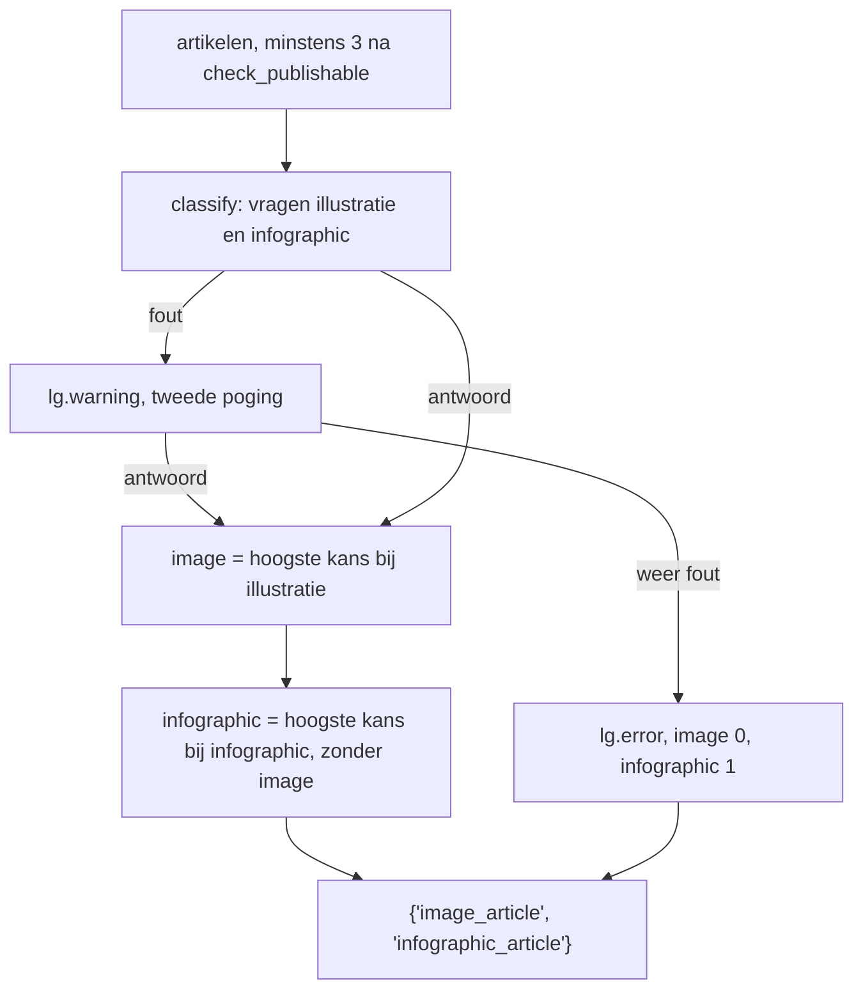

# Visual-selectie via Jev - Plan

## Goal Capsule

- **Objective:** De nieuwsbrief staat ongeveer 50 seconden eerder klaar. Een storing bij het kiezen van de visuals houdt de verzending niet meer tegen, en de gekozen artikelen voor illustratie en infographic zijn minstens zo passend als nu.
- **Means:** `select_articles_for_visuals` wordt één System One `classify()`-aanroep op `CLASSIFY_MODEL` in plaats van een GPT-5-prompt (KTD1).
- **Authority:** Dit plan. Waar het afwijkt van de huidige code in `src/ai.py` en `main.py`, geldt het plan.
- **Stop conditions:** Valt de vergelijking in U3 duidelijk slechter uit dan GPT-5, dan wordt er niet gemerged. De branch blijft dan staan en HP beslist.
- **Execution profile:** Test-first op de keuzelogica in `src/ai.py`. De modelaanroep wordt gemockt zoals bij `classify_reply`. U3 is een handmatige kwaliteitspoort op echte cachedata, geen geautomatiseerde test.

---

## Product Contract

### Summary

De stap die kiest welk artikel de header-illustratie krijgt en welk de infographic, gaat van GPT-5 naar Jev 1.13, het System One model dat al voor `classify_reply` draait. Jev beantwoordt twee keuzevragen in één aanroep en geeft per artikel een kans terug. Twee verschillende artikelen afdwingen gebeurt in code. De prompt `src/prompts/select_visuals.md` en `SELECTION_MODEL` verdwijnen.

### Problem Frame

Deze stap duurt volgens `data/app.log` 27 tot 81 seconden, meestal zo'n 50, van een run van ongeveer 3,5 minuut. GPT-5 redeneert en schrijft daarbij `image_description` en `infographic_description`, die nergens gelezen worden: `main.py` gebruikt alleen de twee indexen. Het is dus een classificatie die als tekstgeneratie wordt uitgevoerd. Faalt de aanroep na vijf pogingen, dan gooit `retry_prompt` door en gaat er die dag geen nieuwsbrief uit, terwijl het om een cosmetische keuze gaat.

### Key Decisions

- **Jev in plaats van GPT-5 voor de visual-selectie.** Snelheid telt hier, en de beschrijvingen die alleen GPT-5 levert worden niet gebruikt. Governs R1, R2.
- **Een storing kost de visual-keuze, niet de nieuwsbrief.** Governs R4.

### Requirements

**Keuze**

- R1. Illustratie en infographic krijgen altijd twee verschillende artikelen, beide een geldige index in de artikellijst.
- R2. De illustratie krijgt het artikel dat Jev daarvoor het meest geschikt vindt. De infographic krijgt het meest geschikte artikel dat de illustratie niet al heeft.
- R3. De teruggegeven vorm blijft `{'image_article': int, 'infographic_article': int}`, zodat `main.py` en de herindexering daarin ongewijzigd werken.

**Falen**

- R4. Faalt de Jev-aanroep, dan krijgt de illustratie artikel 0 en de infographic artikel 1. Dat wordt gelogd met `lg.error`, zodat Janitor het ziet, en de run gaat door.

**Opruimen**

- R5. `SELECTION_MODEL`, `src/prompts/select_visuals.md` en de fallbacks in `main.py` voor een ontbrekende of te grote infographic-index verdwijnen.

### Success Criteria

- In `data/app.log` zit na livegang minder dan 2 seconden tussen `Selecting articles for visuals...` en `Generating image...`.
- In de vergelijking van U3 beoordeelt HP de keuze van Jev bij hooguit twee van de tien nieuwsbrieven als duidelijk slechter dan die van GPT-5.

### Scope Boundaries

- De Colofon in `src/formatter.py` blijft ongewijzigd. Daar staat geen selectiemodel in.
- `retry_prompt` blijft bestaan, want `extract_relevant_source_text` gebruikt hem nog.
- De andere LLM-stappen (copywrite, editor, extractie, beelden) blijven zoals ze zijn. Jev kan geen tekst of beelden genereren.

### Deferred to Follow-Up Work

- Bronmails vooraf door Jev laten filteren op relevantie. Trigger: de weekly loopt drie weken achter elkaar tegen `MAX_TOTAL_LEN` aan en HP merkt dat er nieuws wegvalt.

---

## Planning Contract

### Key Technical Decisions

- KTD1. **Eén `classify()` met `questions=` en twee `choice`-vragen, `illustratie` en `infographic`.** De opties zijn de artikelen, met de index als string-sleutel (`'0'`, `'1'`, ...) en titel plus samenvatting als omschrijving. Twee vragen in één aanroep betekent één netwerkronde. Jev accepteert tot 255 opties, dus 8 artikelen past ruim. (session-settled: user-approved, gekozen boven GPT-5 behouden en de ongebruikte beschrijvingen schrappen: het is een classificatie en die doet Jev in minder dan een seconde)
- KTD2. **Eerst de illustratie, dan de infographic uit de rest (R2), niet het paar met de hoogste gezamenlijke kans.** Jev geeft vaak kansen van 1.0 en 0.0. Dan staan alle paren met gelijke som of gelijk product gelijk en beslist toch een tiebreak. De volgorde "illustratie eerst" is die tiebreak, uitgeschreven als regel. Staan de overige kansen voor de infographic ook gelijk, dan wint de laagste index, zodat de uitkomst deterministisch is.
- KTD3. **Geen drempel op `confidence`.** Bij `classify_reply` kost een foute keuze een uitschrijving. Hier kost hij hooguit een minder passend plaatje, en er is altijd een keuze nodig.
- KTD4. **Eén eigen herhaalpoging, daarna de fallback.** Justai's systemone-provider probeert alleen 429 en 529 zelf opnieuw (`RETRY_STATUSES`, twee keer). Een timeout, een 5xx of een verbindingsfout faalt daar meteen. Zonder eigen poging zou één netwerkhik Janitor alarmeren, en dat botst met de projectregel "retry, don't alert" op transiente fouten. Daarom: bij elke fout één nieuwe poging met `lg.warning`, en pas als die ook faalt `lg.error` plus de fallback van R4. Jev antwoordt in minder dan een seconde, dus een tweede poging is goedkoop. Een langere lus is niet nodig voor een beslissing waarvoor een vaste fallback volstaat.
- KTD6. **De vangst van R4 omvat de aanroep én het uitlezen van het antwoord, met `except Exception`.** Een onverwachte antwoordvorm geeft een `KeyError` in justai's `unpack` of in de keuzelogica van KTD2. Alleen justai-excepties vangen zou die doorlaten, en dan gaat er geen nieuwsbrief uit. De brede vangst is hier geen stille swallow, want R4 logt `lg.error`. Het commentaar in de code noemt die reden.
- KTD5. **`cached=False`, zoals bij `classify_reply`.** Het gedrag blijft dan gelijk aan dat van de GPT-5-aanroep, die ook niet cachete.

### High-Level Technical Design

### Assumptions

- De fallback van R4 (0 en 1) is gekozen omdat er dankzij `check_publishable` altijd minstens 3 artikelen zijn. Een assert op minstens 2 artikelen legt die voorwaarde vast.
- Of Jev de smaakvraag "welk artikel levert een mooie illustratie op" even goed beantwoordt als GPT-5, is onbekend. U3 beslist dat vóór de merge.
- De formulering van de state en de opties (alleen een korte contextzin als state met titel plus samenvatting per optie, of de hele artikellijst als state) is een startpunt. U3 mag die aanpassen op basis van de uitkomsten.

---

## Implementation Units

### U1. Visual-selectie via Jev in `src/ai.py`

- **Goal:** `select_articles_for_visuals` kiest via Jev en voldoet aan R1 tot en met R4.
- **Requirements:** R1, R2, R3, R4, R5 (deel `SELECTION_MODEL` en prompt). KTD1 tot en met KTD6.
- **Dependencies:** geen.
- **Files:** `src/ai.py`, `src/prompts/select_visuals.md` (verwijderen), `tests/main.py`.
- **Approach:**
  1. Twee instructieconstanten naast `CLASSIFY_INSTRUCTIONS`, in het Nederlands. Illustratie: visueel rijk, een metafoor, concrete objecten, geen generiek robotbeeld. Infographic: concrete cijfers, vergelijkingen, tijdlijnen, percentages.
  2. Opties bouwen volgens KTD1, aanroepen via `Model(CLASSIFY_MODEL).classify(..., questions=..., cached=False)`.
  3. Kiezen volgens KTD2 uit de `probabilities` per vraag. De sleutels zijn strings en worden terug naar int omgezet.
  4. Aanroep plus keuze samen in één poging. Bij een fout volgt één herhaling (KTD4), en daarna de fallback van R4, met de vangst zoals KTD6 die afbakent.
  5. `SELECTION_MODEL` en `src/prompts/select_visuals.md` verwijderen.
- **Execution note:** Eerst de tests schrijven, tegen een gemockte `Model`.
- **Patterns to follow:** `classify_reply` en `REPLY_CATEGORIES` in `src/ai.py`. De helper `_classify_model` en `test_classify_*` in `tests/main.py`. Nieuwe tests ook opnemen in de lijst in `main()` onderaan `tests/main.py`.
- **Test scenarios:**
  - Jev kiest voor illustratie artikel 2 en voor infographic artikel 4. Resultaat is `{'image_article': 2, 'infographic_article': 4}`.
  - Beide vragen kiezen artikel 1 met kans 1.0, en bij infographic heeft artikel 3 de op één na hoogste kans. Resultaat is illustratie 1, infographic 3.
  - Beide vragen kiezen artikel 0 met kans 1.0 en alle andere kansen zijn 0.0. De infographic wordt artikel 1, de laagste overgebleven index.
  - De aanroep krijgt twee vragen mee, `illustratie` en `infographic`, allebei van type `choice`, met precies één optie per artikel met sleutels `'0'` tot en met `'n-1'`.
  - Elke optie bevat de titel van het bijbehorende artikel.
  - De eerste `Model.classify` gooit `ConnectionException` en de tweede geeft een geldig antwoord. Resultaat is de keuze van Jev, er is één `lg.warning` en geen `lg.error`.
  - `Model.classify` gooit twee keer `ConnectionException`. Resultaat is `{'image_article': 0, 'infographic_article': 1}` en `lg.error` is één keer aangeroepen.
  - `Model.classify` geeft twee keer een antwoord zonder de vraag `infographic`. Resultaat is de fallback van R4 en er is één `lg.error`.
  - Met precies 3 artikelen zijn beide indexen geldig en verschillend.
- **Verification:** alle nieuwe en bestaande tests slagen. `grep` op `SELECTION_MODEL` en `select_visuals` vindt niets meer in `src/` en `main.py`.

### U2. Fallbacks in `main.py` opruimen

- **Goal:** `main.py` vertrouwt op R1 en R3 en bevat geen afvanging meer voor een index die niet kan voorkomen.
- **Requirements:** R5.
- **Dependencies:** U1 (beide raken `tests/main.py`, en de opruiming leunt op R1).
- **Files:** `main.py`, `tests/main.py`.
- **Approach:**
  1. Weg: de tak voor `infographic_original_index is None` met de bijbehorende `lg.warning`, en de klem voor `>= len(articles)`. `visual_selection['infographic_article']` wordt direct gelezen in plaats van via `.get()`.
  2. Blijft: de herindexering nadat het image-artikel naar voren is geschoven, inclusief de tak voor `== article_index`. Die is niet dood: bij `--cached` geeft `generate_ai_image` altijd index 0 terug, ongeacht de selectie, en dan kan de infographic-index daarmee samenvallen.
- **Patterns to follow:** `_run_main` in `tests/main.py`, dat `select_articles_for_visuals` al vervangt door een double.
- **Test scenarios:**
  - Selectie `{'image_article': 2, 'infographic_article': 0}`. `generate_infographic` krijgt `infographic_article` 1 mee, omdat artikel 0 één plek opschuift.
  - Selectie `{'image_article': 0, 'infographic_article': 1}`. `generate_infographic` krijgt 1 mee.
  - `generate_ai_image` geeft 0 terug (de cache-situatie) terwijl de selectie `{'image_article': 2, 'infographic_article': 0}` was. `generate_infographic` krijgt 0 mee.
- **Verification:** de bestaande `test_main_*`-tests en de nieuwe scenario's slagen.

### U3. Vergelijking GPT-5 tegen Jev op bestaande nieuwsbrieven

- **Goal:** HP kan vóór de merge beoordelen of Jev minstens zo goed kiest als GPT-5 (Success Criteria).
- **Requirements:** Success Criteria, tweede punt.
- **Dependencies:** U1.
- **Files:** geen in de repo. Een wegwerpscript in de scratchpad, niet gecommit.
- **Approach:**
  1. Voor tien `cache/*_edited.jsonl`-bestanden (er staan er 18) beide keuzes naast elkaar zetten. De GPT-5-keuze komt van de oude prompt, via `git show main:src/prompts/select_visuals.md`, met `SELECTION_MODEL` zoals op main. De Jev-keuze komt van de nieuwe functie.
  2. Per nieuwsbrief een tabel met de titels van de artikelen, de keuze van beide modellen, en de looptijd van de Jev-aanroep. Een extra kolom geeft aan of beide vragen hetzelfde artikel kozen en of de infographic daardoor via de tiebreak van KTD2 (laagste index) is gekozen.
  3. HP beoordeelt de gevallen waar ze verschillen, en de tiebreak-rijen apart. Komen die vaak voor en vallen ze slecht uit, dan is dat een reden om de keuzeregel van KTD2 te herzien. Bij een tegenvallend resultaat eerst de formulering aanpassen (Assumptions, derde punt) en opnieuw draaien, en pas daarna het criterium toepassen.
- **Execution note:** `cache/` staat in `.gitignore` en bestaat dus niet in een worktree. Het script leest de cache via het pad van de hoofdcheckout (zie `docs/solutions/logic-errors/gitignored-runtime-state-in-een-worktree.md`).
- **Test expectation:** geen. Dit is een handmatige kwaliteitspoort.
- **Verification:** HP heeft de tabel gezien en expliciet ja of nee gezegd.

### U4. Architectuurdocument bijwerken

- **Goal:** `docs/architecture.md` beschrijft de nieuwe situatie.
- **Requirements:** R5.
- **Dependencies:** U1.
- **Files:** `docs/architecture.md`.
- **Approach:**
  1. Onder "AI-modellen" de regel voor `SELECTION_MODEL` weghalen en bij `CLASSIFY_MODEL` vermelden dat hij ook de visual-selectie doet.
  2. Stap 8 van de data flow: selectie via Jev, twee verschillende artikelen, en de fallback 0 en 1 bij een storing (R4).
- **Test expectation:** geen, alleen documentatie.
- **Verification:** geen verwijzing meer naar GPT-5 of `SELECTION_MODEL` in het document.

### Uitvoeringstabel

| # | Task | Touches | Depends on |
|---|------|---------|------------|
| 01 | U1. Visual-selectie via Jev | `src/ai.py`, `src/prompts/select_visuals.md`, `tests/main.py` | - |
| 02 | U2. Fallbacks in `main.py` opruimen | `main.py`, `tests/main.py` | 01 |
| 03 | U3. Vergelijking GPT-5 tegen Jev | scratchpad, leest `cache/` van de hoofdcheckout | 01 |
| 04 | U4. Architectuurdocument | `docs/architecture.md` | 01 |

Na 01 kunnen 02, 03 en 04 parallel lopen. Die raken geen gemeenschappelijke bestanden.

---

## Verification Contract

| Poort | Commando of actie | Bewijst |
|---|---|---|
| Unit tests | `uv run python tests/main.py` | U1, U2 |
| Kwaliteitspoort | Vergelijkingstabel uit U3, oordeel van HP | Success Criteria, tweede punt |
| Scope | `gitnexus_detect_changes()` vóór de commit. Alleen `select_articles_for_visuals`, `main` en de tests zijn geraakt. | Geen ongewenste verandering elders |
| Na livegang | Tijd tussen `Selecting articles for visuals...` en `Generating image...` in `data/app.log` | Success Criteria, eerste punt |

---

## Definition of Done

- U1, U2 en U4 zijn af en `uv run python tests/main.py` slaagt volledig.
- HP heeft na U3 expliciet ingestemd met de keuzes van Jev.
- `SELECTION_MODEL` en `select_visuals.md` bestaan niet meer, en er staat geen code van verworpen varianten meer in de diff.
- Het vergelijkingsscript staat niet in de repo.
